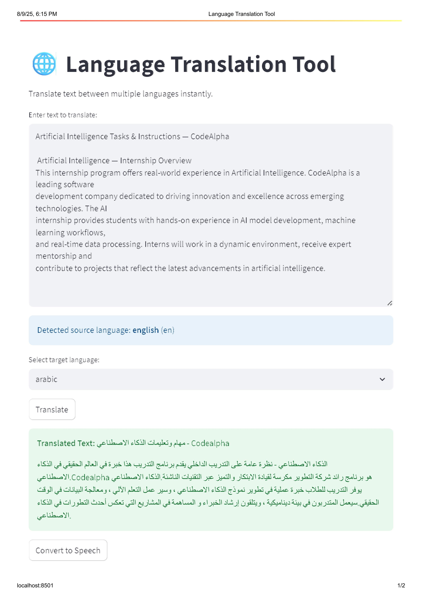

# 🌍 Language Translation Tool (with Text-to-Speech & Auto Language Detection)

## 📌 Overview
This project is part of my **CodeAlpha Artificial Intelligence Internship**.  

The **Language Translation Tool** allows users to:
- Enter text in **any language**.
- Automatically **detect** the source language.
- **Translate** text into a target language of their choice.
- **Read aloud** the translated text using **Text-to-Speech (TTS)**.

It’s a simple yet powerful application that demonstrates **real-world AI integration** using translation APIs and speech synthesis.

---

## 🎯 Features
✅ **Auto Language Detection** – No need to manually select the source language.  
✅ **Multi-Language Translation** – Supports dozens of languages via API.  
✅ **Text-to-Speech** – Hear the translated text spoken in the target language.  
✅ **Simple Web Interface** – Easy-to-use input & output display.  
✅ **Fast & Accurate** – Uses industry-standard APIs for instant translations.

---

## 🛠️ Tech Stack
- **Python** – Core backend logic.
- **Streamlit** – For building the user-friendly web interface.
- **Googletrans** – For translation & language detection.
- **gTTS (Google Text-to-Speech)** – For converting text into spoken audio.

---

## 📷 Screenshots
### Main Interface
  
*(Example: Translating English to Arabic with TTS button)*

---

## ⚙️ Installation & Usage

### 1️⃣ Clone this repository
```bash
git clone https://github.com/KisamiYounes/-Artificial-Intelligence-CodeAlpha.git
cd CodeAlpha_LanguageTranslationTool
```

### 2️⃣ Install dependencies
```bash
pip install -r requirements.txt
```
### 3️⃣ Run the application
```bash
streamlit run app.py
```
### 4️⃣ Use the tool
Type or paste your text in the input box.

Select the target language.

Click Translate.

Click Play Audio to hear the translated text.

📦 Requirements
Make sure you have Python 3.8+ installed. Install dependencies from requirements.txt:
```
streamlit
googletrans==4.0.0-rc1
gtts
```
📜 Project Structure
```bash
📂 CodeAlpha_LanguageTranslationTool
 ├── app.py                  # Main application code
 ├── requirements.txt        # Dependencies list
 ├── assets/                 # Images, screenshots, audio files
 ├── README.md               # Project documentation
```
🚀 Future Improvements
Add copy to clipboard function.

Support offline translation for some languages.

Improve UI design with better styling.

🙌 Acknowledgements
CodeAlpha – For the internship opportunity.

Google Translate API – For translation & language detection.

gTTS – For text-to-speech support.

Streamlit – For fast UI development.

📄 License
This project is licensed under the MIT License.

